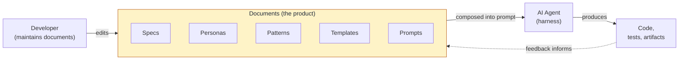
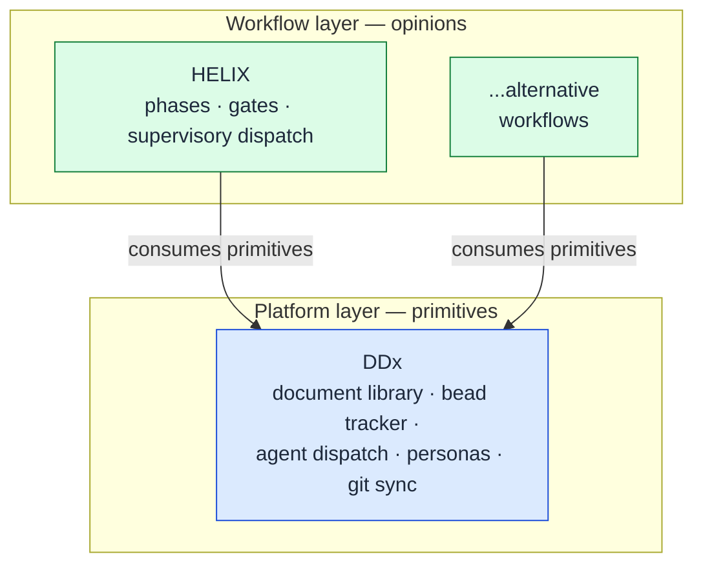

The ideas behind DDx and document-driven development.

## What DDx Is

DDx (Document-Driven Development eXperience) is the **shared infrastructure
platform for document-driven development**. It provides the primitives that
developers and workflow tools use to maintain, compose, and deliver the
documents AI agents consume to build software.

The core thesis: **document quality, not agent capability, is the bottleneck.**
Well-maintained abstractions — requirements, architecture, design, tests —
produce better software than working at the code level alone. DDx encodes that
insight into infrastructure.



## Platform and Workflow

DDx is the platform layer; workflow tools sit on top with explicit boundaries.
Each layer is independently useful and replaceable.

| Layer | Project | Owns |
|-------|---------|------|
| **Platform** | [DDx](https://github.com/DocumentDrivenDX/ddx) | Document library, bead tracker, agent dispatch, personas, templates, git sync |
| **Workflow** | [HELIX](https://github.com/DocumentDrivenDX/helix) | Phases, gates, supervisory dispatch, methodology |

DDx provides primitives. HELIX and other consumers provide opinions.




**Why split platform from workflow?** Mixing methodology into platform code
locks teams into one way of working. Keeping the platform opinion-free lets
HELIX evolve, lets alternative workflows exist, and lets DDx serve both
fully-autonomous and human-driven teams from the same primitives.


## The Operator Loop

DDx-powered work follows a continual-improvement loop:

```text
Plan -> Execute -> Measure -> Adapt
```

Planning updates specs, acceptance criteria, measurement expectations, and the
bead DAG. Execution runs bounded tasks through `ddx run`, `ddx try`, and
`ddx work`. Measurement reads tests, review verdicts, run evidence, costs,
stale-doc signals, failed attempts, and operational feedback. Adaptation
updates specs, refines beads, changes process assets, or stops.

That loop is DDx's operating model, not a workflow methodology. HELIX can map
its phases onto it, and other workflows can do the same.

## Documents Are the Product

The fundamental shift: **you maintain documents, agents produce code.**

In traditional development, code is the primary artifact. In document-driven
development, the primary artifacts are the documents that tell agents what to
build and how to build it:

- **Prompts** — instructions that direct agent behavior for specific tasks
- **Personas** — behavioral definitions that shape how agents approach work
- **Patterns** — proven solutions to recurring problems, written for agent
  consumption
- **Templates** — project and file blueprints with variable substitution
- **Specs** — requirements and designs that define what to build

The quality of agent output follows directly from the quality of these
documents. Better documents produce better code, every time.

## What DDx Provides

- **Document library** — structured, versioned, agent-discoverable artifacts
  in the repository.
- **Bead tracker** — work items with a dependency DAG, ready/blocked queues,
  and JSONL interchange. Beads are the unit of work agents execute.
- **Agent service** — harness dispatch via `ddx run` (Claude, Codex, Gemini,
  local models) with session logging and a single prompt envelope. Comparison
  and adversarial review compose `ddx run` at the skill layer.
- **Queue drain** — `ddx work` drains the bead queue with isolated worktrees,
  automatic review, and recovery. `ddx try` handles one bead attempt.
- **Project-local install** — `ddx init` and `ddx install <plugin>` only touch
  `<projectRoot>`. The only global artifact is `ddx-server`.
- **Single `ddx` skill** — one consolidated skill, not a fleet. One surface
  for agents to learn.

## What DDx Is Not

- **Not a methodology.** No phases, no gates, no prescribed artifact types —
  workflow tools own those.
- **Not a storage system.** Files in Git. No proprietary backend.
- **Not an editor or IDE.** Editing happens wherever you already work.
- **Not opinionated about agents.** Any harness with a prompt-in/output-out
  contract plugs in.

## Read Next

- [Principles](principles/) — the load-bearing decisions behind DDx.
- [Operator Loop](operator-loop/) — how DDx turns evidence into the next plan.
- [Architecture](architecture/) — how beads, personas, and the
  project-local install model fit together.
- [Run Architecture](run-architecture/) — the layered `ddx run` /
  `ddx try` / `ddx work` model that drains the bead queue.
- [Glossary](glossary/) — quick definitions for the terms used across the
  docs.
