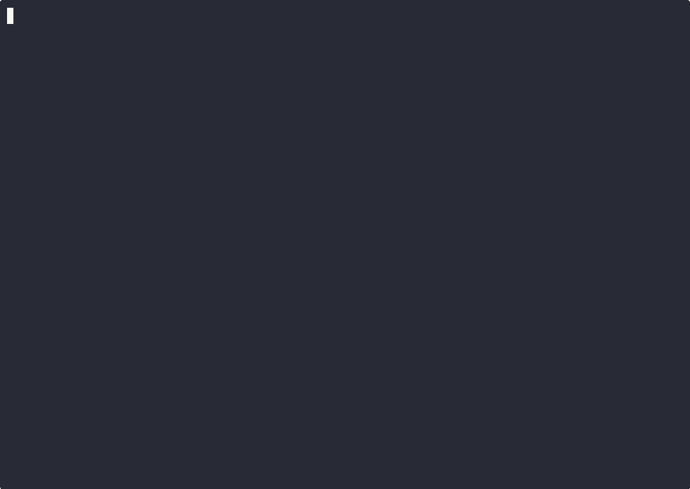

# DDx — Document-Driven Development eXperience

[](https://github.com/DocumentDrivenDX/ddx/actions/workflows/ci.yml)
[](https://github.com/DocumentDrivenDX/ddx)
[](https://opensource.org/licenses/MIT)

> Documents drive the agents. DDx drives the documents.

<p align="center">
  
</p>

**[Full Documentation →](https://DocumentDrivenDX.github.io/ddx/)**

## What You Just Saw

DDx + HELIX takes a project from zero to working software:

1. `ddx init` — create a document library
2. `ddx install helix` — install the HELIX workflow plugin
3. Agent frames the project — creates PRD, feature specs, and tracker beads
4. Agent builds it — TDD, one commit per bead, all tests passing
5. Agent evolves it — adds a feature, updates specs, extends code
6. `ddx bead list` — every step tracked, every bead closed

## Quick Start

```bash
# Install DDx
curl -fsSL https://raw.githubusercontent.com/DocumentDrivenDX/ddx/main/install.sh | bash

# Initialize your project
cd your-project
ddx init

# Install HELIX workflow plugin
ddx install helix

# Explore
ddx doctor
ddx persona list
ddx bead list
```

## Pre-claim Intake and Silent-Idle Diagnosis

Before a bead is claimed, DDx runs the pre-claim intake hook and evaluates the
shared `readiness_checks` payload. The intake contract accepts these canonical
verdict forms:

- JSON bool `true` -> `pass`
- JSON bool `false` -> `fail`
- JSON strings are passed through after trimming
- `null` or absent -> empty

See `ClassifyReadinessWithMode`
(`cli/internal/agent/readiness_classification.go:56-115`) for the mapping from
readiness classifications to worker behavior. The worker treats the shared
schema as a read-only intake contract and classifies the verdict into one of
the following behaviors:

- `system_unready` / `intake_error` are hard errors from the hook, but the
  worker fail-opens and skips the claim instead of parking the bead.
- `needs_refine` is warn-only in warn mode and becomes operator-attention /
  park in block mode.
- `operator_required` parks the bead.
- `needs_split` parks the bead for decomposition.

If the worker idles on a full queue, inspect the latest
`.ddx/agent-logs/agent-loop-*.jsonl` file and start with `loop.idle` events.
Repeated identical blocker details are escalated after
`preClaimIdleEscalationThreshold` cycles (`ddx-df77e668`), so a silent stall
with the same fingerprint should eventually become a
`loop.operator_attention` signal instead of looping forever. Track the exact
blocker detail, and distinguish `preclaim_systemic` from
`preclaim_tracker_contention`.

For a queue that is technically moving but still claims very slowly, use the
claim-success-rate warning knobs `--claim-rate-window` and
`--claim-rate-threshold` to surface the low-claim-rate condition. These warn
when the rolling claim success rate stays low even though the queue is not
fully idle, which helps separate slow progress from a silent intake failure.

**Related reliability context:** AR-2026-05-17 follow-up; lock handling
(ddx-57c40485); route-resolution wedge handling (ddx-8f2e0ebf).

## Development

### Local Install

The canonical local binary is `${HOME}/.local/bin/ddx`. Use the installer for
all local deployments:

```bash
make build
./install.sh --from-build
```

`make install` runs the same installer path after building. Avoid copying DDx
to other PATH directories by hand; add an installer mode when a different
deployment source is needed. Use `./install.sh --from-build --no-shell --prefix
"$TMPDIR/ddx-install-test"` for throwaway installer checks.

### Build and Test CLI

```bash
cd cli
make dev      # Start Go development server
make test     # Run all tests
```

### Frontend Development (SvelteKit)

The web UI is built with SvelteKit and Bun:

```bash
# Install dependencies and start dev server
cd cli/internal/server/frontend && bun install && bun run dev

# Generate GraphQL types from schema
bun run houdini:generate

# Run unit tests
bun run test

# Run e2e tests with Playwright
bun run test:e2e
```

## Build Something

```bash
# Frame: create specs and work items
ddx run --harness claude --prompt frame-prompt.md

# Build: agent implements per specs, TDD, closes beads
ddx try ddx-abc12345

# Evolve: add a feature
ddx work

# Inspect
ddx bead list          # all beads tracked
ddx log                 # history
ddx doc history PRD-001  # spec evolution
ddx metric list        # metric artifacts
ddx metric show MET-001  # metric definition + recent history
```

`ddx metric` inspection commands are read-only projections over the exec
substrate. `ddx metric run <MET-id>` is the convenience wrapper for
`ddx exec run <definition-id>` that resolves the latest active definition
bound to the metric artifact.

## Key Commands

| Command | What it does |
|---------|-------------|
| `ddx init` | Initialize document library |
| `ddx install <name>` | Install a workflow plugin |
| `ddx doctor` | Validate installation health |
| [Prose quality support](docs/prose-quality.md) | Guidance for `ddx doc prose --changed` and prose config |
| `ddx bead create/list/ready` | Track work items |
| `ddx metric list/show/validate/run/history/compare/trend` | Inspect metric artifacts and run history |
| `ddx run` | Invoke an AI agent once |
| `ddx try` | Execute a specific bead |
| `ddx work` | Drain the bead queue |
| `ddx log` | View history |
| `ddx persona bind` | Assign personas to roles |

## Ecosystem

```
Workflow tools (HELIX, etc.)  →  opinionated practices
DDx (this project)            →  document infrastructure
AI agents (Claude, etc.)      →  consume docs, produce code
```

## License

MIT. See [LICENSE](LICENSE).
