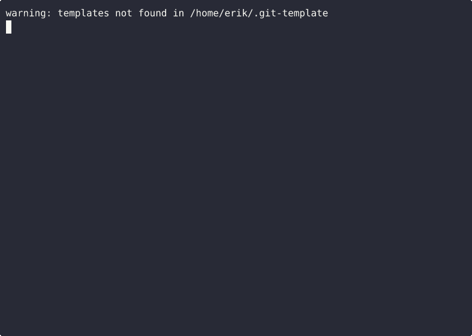

# DDx — Document-Driven Development eXperience

[](https://github.com/DocumentDrivenDX/ddx/actions/workflows/ci.yml)
[](https://github.com/DocumentDrivenDX/ddx)
[](https://opensource.org/licenses/MIT)

> Documents drive the agents. DDx drives the documents.

<p align="center">
  
</p>

**[Full Documentation →](https://DocumentDrivenDX.github.io/ddx/)**

## What You Just Saw

DDx + HELIX takes a project from zero to working software:

1. `ddx init` — create a document library
2. `ddx install helix` — install the HELIX workflow plugin
3. Agent frames the project — creates PRD, feature specs, and tracker beads
4. Agent builds it — TDD, one commit per bead, all tests passing
5. Agent evolves it — adds a feature, updates specs, extends code
6. `ddx bead list` — every step tracked, every bead closed

## Quick Start

```bash
# Install DDx
curl -fsSL https://raw.githubusercontent.com/DocumentDrivenDX/ddx/main/install.sh | bash

# Initialize your project
cd your-project
ddx init

# Install HELIX workflow plugin
ddx install helix

# Explore
ddx doctor
ddx persona list
ddx bead list
```

## Build Something

```bash
# Frame: create specs and work items
ddx agent run --harness claude --prompt frame-prompt.md

# Build: agent implements per specs, TDD, closes beads
ddx agent run --harness claude --prompt build-prompt.md

# Evolve: add a feature
ddx agent run --harness claude --prompt evolve-prompt.md

# Inspect
ddx bead list          # all beads tracked
ddx agent usage        # token consumption
ddx doc history PRD-001  # spec evolution
```

## Key Commands

| Command | What it does |
|---------|-------------|
| `ddx init` | Initialize document library |
| `ddx install <name>` | Install a workflow plugin |
| `ddx doctor` | Validate installation health |
| `ddx bead create/list/ready` | Track work items |
| `ddx agent run` | Invoke an AI agent |
| `ddx agent usage` | View token consumption |
| `ddx persona bind` | Assign personas to roles |

## Ecosystem

```
Workflow tools (HELIX, etc.)  →  opinionated practices
DDx (this project)            →  document infrastructure
AI agents (Claude, etc.)      →  consume docs, produce code
```

## License

MIT. See [LICENSE](LICENSE).
