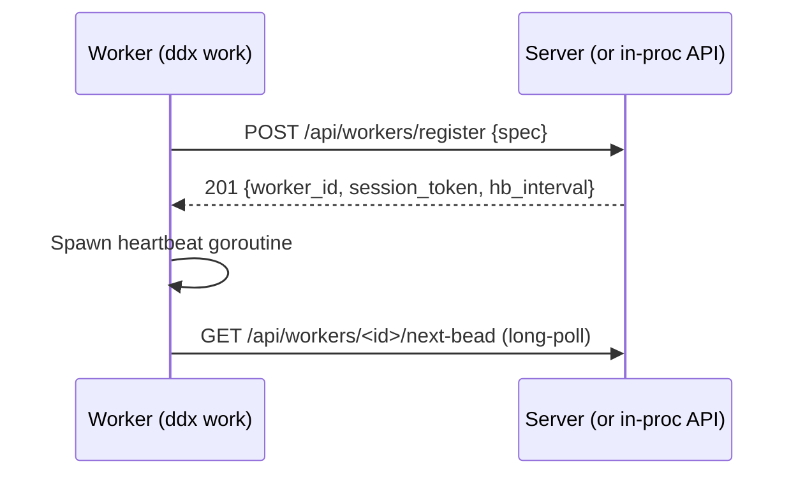
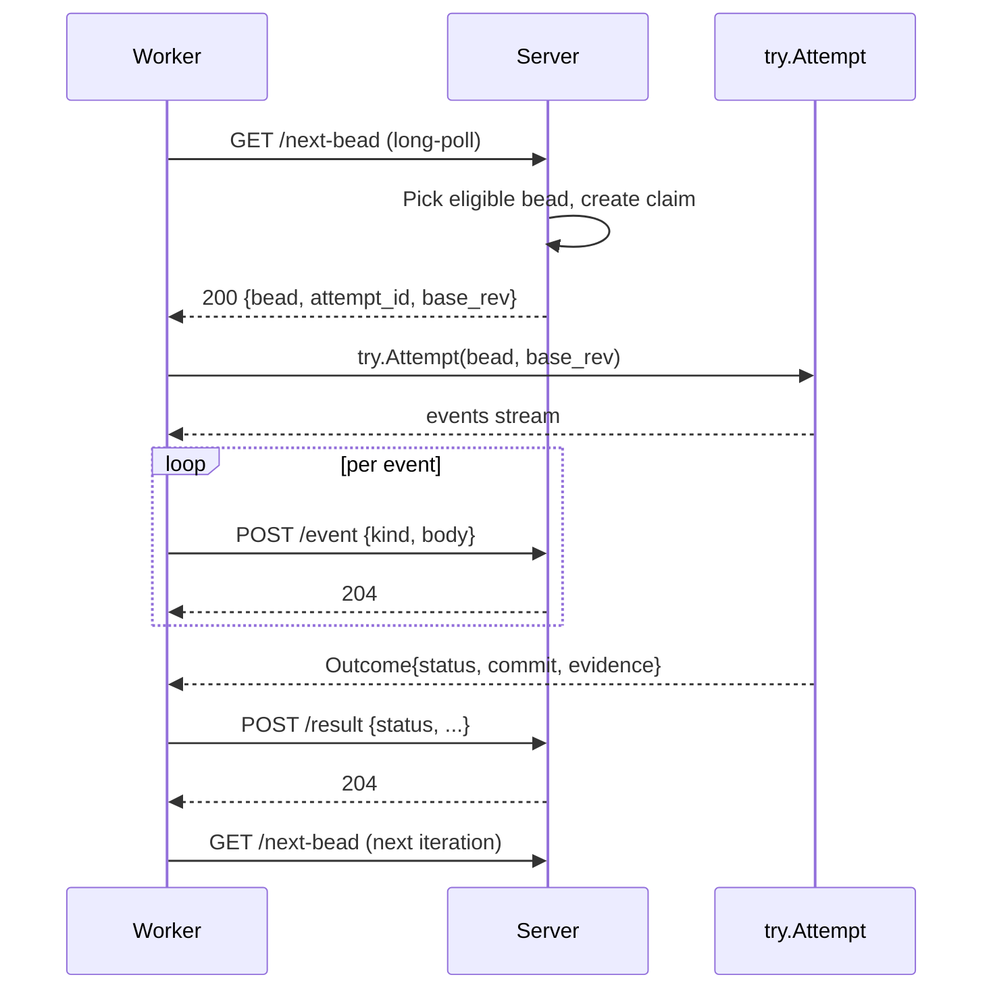
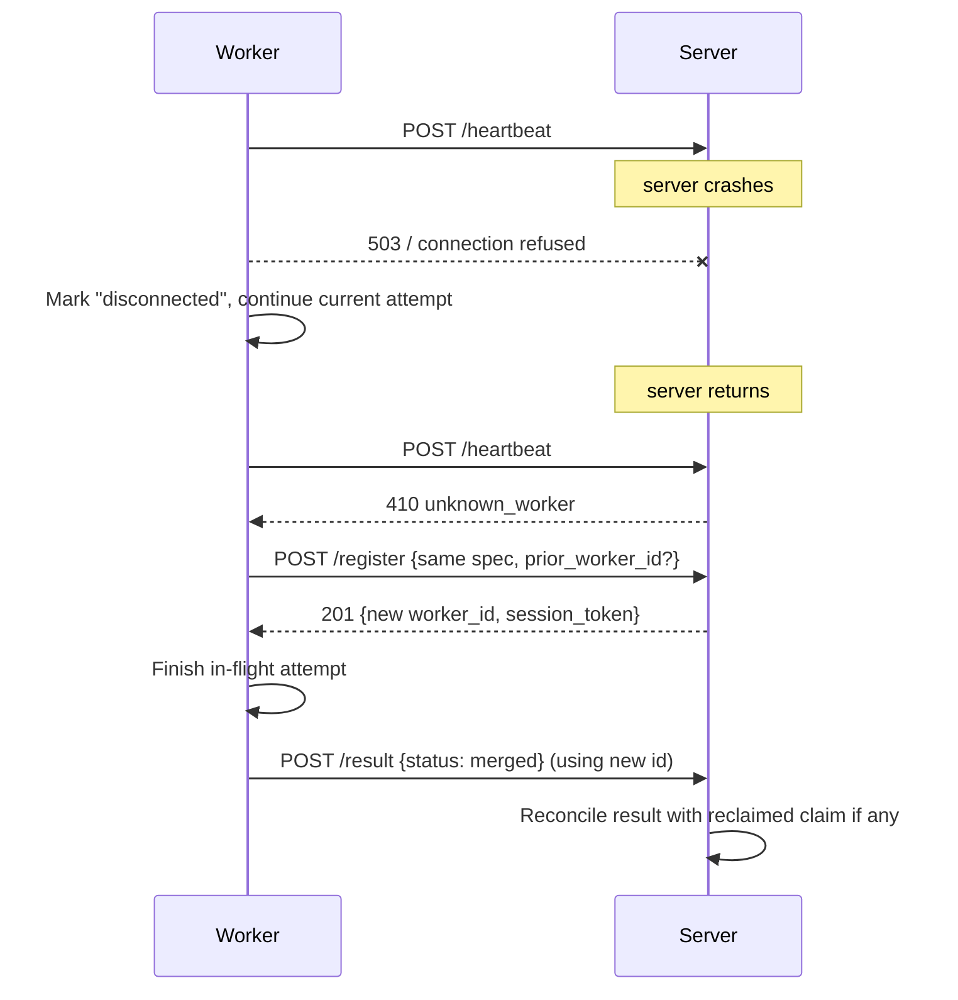
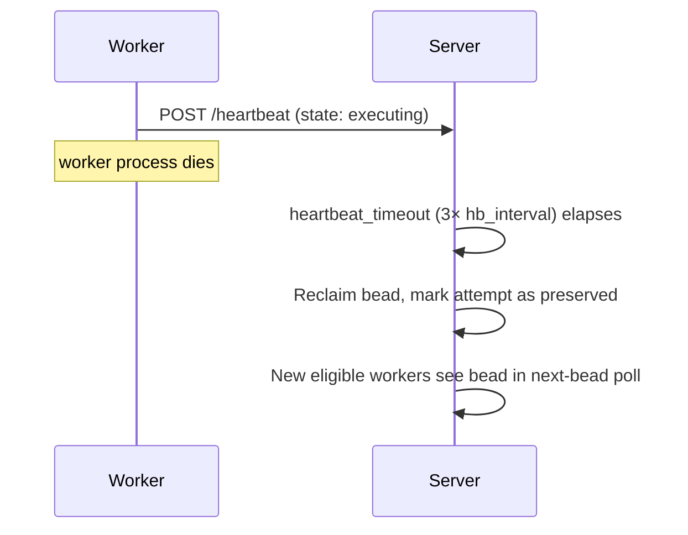
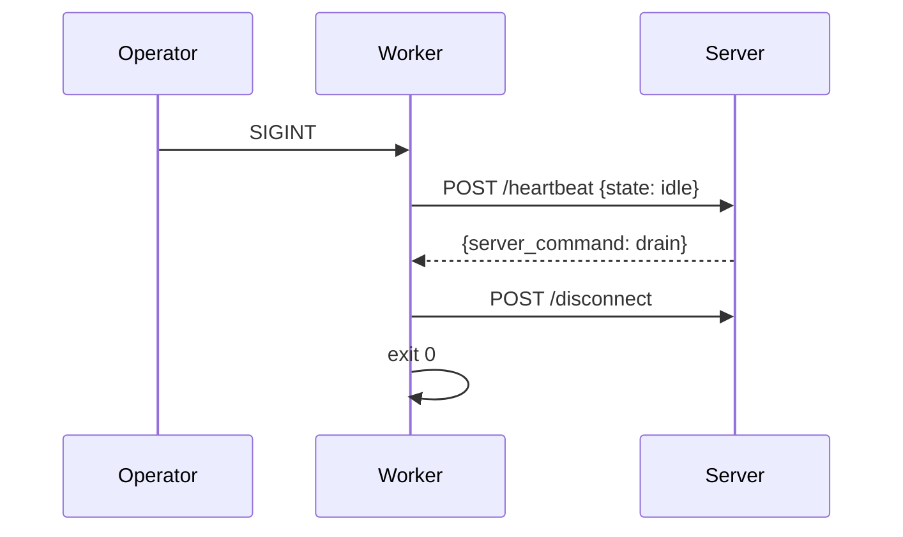

---
ddx:
  id: ADR-022
  depends_on:
    - FEAT-006
    - FEAT-002
    - FEAT-010
    - ADR-006
    - ADR-007
    - ADR-021
---
# ADR-022: Worker Client–Server Architecture

**Status:** Proposed
**Date:** 2026-05-02
**Authors:** TD bead `ddx-076147ee`
**Layout note:** The bead description suggested `docs/helix/03-decide/`. The
HELIX layout in this repo places ADRs at `docs/helix/02-design/adr/`. This ADR
is filed in the actual location to keep the index discoverable; the next ADR
number after ADR-021 is ADR-022.

## Context

Operators have observed a structural failure mode: when `ddx-server`
restarts, in-flight worker subprocesses lose their connection to the
orchestrator. Today there are two execution paths that diverge in lifecycle,
configuration plumbing, and observability:

- **`--local` path.** `ddx work` (a.k.a. `ddx agent execute-loop`) runs an
  in-process drain loop that talks to the bead store directly
  (`cli/internal/agent/execute_bead_loop.go`).
- **Server-spawned path.** The server forks a worker process, hand-marshals
  an `ExecuteLoopWorkerSpec` over an internal contract, and tracks the PID
  in `.ddx/workers/`. The worker reaches back into the bead store directly,
  not through the server.

Three open beads diagnose the symptom-space:

- `ddx-29058e2a` — five flags silently dropped on the server path because
  the spec is hand-maintained as parallel structs across six layers.
- `ddx-5cb6e6cd` — refactor epic that splits `execute_bead_loop` into
  `run/`, `try/`, `work/` packages, exposing an implicit state machine
  inside a 700-line function.
- `ddx-dc157075` — workers exit prematurely on an empty queue because
  `--poll-interval=0` is the default and the per-Run `attempted` map is
  scoped to one drain pass.

`ddx-4c51d33e` (closed) demonstrated the related security problem: any
worker that touches the bead store directly has to reimplement project
scoping; the GraphQL resolver got that wrong for `DocumentByPath`.

The common cause: **the worker is coupled to local in-process state and
the server has no first-class concept of a worker beyond a PID it forked.**
Restart loses the in-flight context because the context lives nowhere
addressable. Each fix to one of the three beads above fixes a leaf without
addressing the trunk.

This ADR exists because the next round of refactors (the `try/` and `work/`
packages, the `ExecuteLoopSpec` unification, the stay-alive fix) will all
re-cement the current bipartite design unless the architectural shift is
agreed first.

## Decision

**Workers are long-lived API clients of the server. The CLI `--local` mode
is a degenerate case of the same client, served by an in-process server
implementation.**

Concretely:

1. A worker process (whether started by `ddx work`, `ddx agent
   execute-loop`, or spawned by the server) registers with a server
   endpoint (loopback or in-process) and receives a `worker_id` and
   `session_token`.
2. The worker drives its own state machine (`idle → claiming → executing →
   reviewing → idle`) and pulls bead assignments from the server via a
   long-poll endpoint.
3. The worker reports progress and final results to the server via API.
4. The server holds the authoritative view of which workers exist, what
   they're doing, and which beads are claimed.
5. If the server restarts, workers detect heartbeat failure, finish the
   current bead in their isolated worktree, and reconnect on server return.
6. If a worker dies, the server's heartbeat-timeout reclaims the bead for
   another worker.

This is **Proposal A** from the bead description, with the **`--local`
collapse** detail of Proposal C: there is one code path, parameterised by
which API implementation the worker is wired to (HTTP for cross-process,
in-process function calls for `--local`).

### Why Proposal A (server orchestrates, workers are long-lived clients)

- **Restart-survival is the requirement, not a nice-to-have.** Operators
  reported the current model loses in-flight work on server restart.
  Proposal A is the only one of the three that makes the worker survive
  restart by design — Proposal B sidesteps the question by removing the
  server, and Proposal C makes restart survival contingent on a fallback
  mode.
- **Single source of truth for queue state.** Today the bead store is the
  source of truth, and both the server and workers query it. With
  Proposal A the server owns the *runtime* projection of queue state
  (claims, in-flight attempts, heartbeats); the bead store remains the
  durable substrate. This eliminates the class of bugs where two readers
  of the store reach inconsistent conclusions.
- **One spec, one boundary.** `ExecuteLoopSpec` becomes the registration
  payload. `ddx-29058e2a` is solved by construction: there is exactly one
  struct that crosses one boundary (register), instead of six layers of
  parallel structs.
- **Aligns with the `run/try/work/` split.** `ddx-5cb6e6cd`'s `work/`
  package becomes the worker client; `try/` is invoked by the worker on
  each claim; `run/` is the inner agent invocation. The state machine
  becomes explicit, server-visible, and testable.
- **Project boundaries are enforced once.** The session token is bound to
  a project at registration; every subsequent API call carries it. The
  cross-project leak class (`ddx-4c51d33e`) cannot recur for any
  worker-driven mutation because the token is the project.

### Why not Proposal B (server-as-passive-observer)

- Loses centralised cancel, dynamic priority, and label-filter overrides —
  all of which are on the FEAT-002 / FEAT-006 roadmap.
- Two execution paths persist forever (autonomous local vs.
  server-observed), which is exactly the divergence this TD is trying to
  retire.
- Best-effort event emission is a worse audit trail than what beads
  already give us via `ADR-004`/`ADR-021` (audit-as-bead).

### Why not Proposal C (hybrid with autonomous fallback)

- Hybrid keeps two execution paths and adds a third (the fallback
  transition itself), each with its own race conditions.
- The "fall back to autonomous on heartbeat timeout" branch is the most
  dangerous failure surface: a worker that decides on its own to keep
  running can race a returning server that has already reclaimed the bead.
- The legitimate part of Proposal C — that `--local` should not require a
  network server — is preserved by serving the API in-process for
  `--local`.

## Worker–server API contract

All endpoints require `requireTrusted` (loopback or ts-net `WhoIs`
identity, per ADR-006). The session token is bound to one project; the
server rejects any call whose `worker_id` was issued for a different
project.

### POST /api/workers/register

Request:

```json
{
  "project_root": "/abs/path/to/project",
  "harness": "claude",
  "model_pref": "opus-4.7",
  "label_filter": ["phase:2", "kind:fix"],
  "capabilities": ["bead-attempt", "review"],
  "executor_pid": 12345,
  "executor_host": "host.local",
  "spec_version": "1"
}
```

Response (201):

```json
{
  "worker_id": "wkr-9f3a...",
  "session_token": "tkn-...",
  "heartbeat_interval_ms": 5000,
  "claim_lease_ms": 60000,
  "server_build_sha": "abc1234"
}
```

The full registration request is the unified `ExecuteLoopSpec`; adding a
new flag means adding one field here. (Closes ddx-29058e2a's spec drift by
construction.)

### POST /api/workers/<id>/heartbeat

Request:

```json
{
  "state": "executing",
  "current_bead_id": "ddx-076147ee",
  "current_attempt_id": "20260503T021424-dac100b6",
  "queue_depth_seen": 3
}
```

Response (200):

```json
{
  "server_command": "continue",
  "session_token_renewed": null
}
```

`server_command ∈ {continue, pause, drain, terminate}`. `pause` tells the
worker to finish the current bead and stop claiming new work. `drain` is
"finish current, exit cleanly when idle." `terminate` is "abort current
attempt, preserve worktree, exit." Heartbeat is the only mutual liveness
signal.

### GET /api/workers/<id>/next-bead

Long-poll. Server holds for up to `wait_for_seconds` (default 30) before
returning either an assignment or a bare `wait` envelope. The worker MAY
reissue immediately on bare-wait response.

Response (200):

```json
{
  "bead": { "...": "..." },
  "attempt_id": "20260503T021424-dac100b6",
  "base_rev": "528bb6ee...",
  "claim_lease_ms": 60000
}
```

Or:

```json
{ "wait_for_seconds": 30 }
```

Claim is created server-side at the moment of return; the worker has
`claim_lease_ms` to send the first heartbeat with `state: claiming` or
`executing` before the claim expires.

### POST /api/workers/<id>/event

Request:

```json
{
  "kind": "attempt.started",
  "bead_id": "ddx-076147ee",
  "attempt_id": "20260503T021424-dac100b6",
  "body": { "...": "..." }
}
```

Response: 204.

`kind` mirrors today's bead event log. The server appends to the bead's
event stream; existing readers (CLI, MCP, web UI) see worker events
without code changes.

### POST /api/workers/<id>/result

Request:

```json
{
  "bead_id": "ddx-076147ee",
  "attempt_id": "20260503T021424-dac100b6",
  "status": "merged",
  "evidence_dir": ".ddx/executions/20260503T021424-dac100b6",
  "commit_sha": "deadbeef...",
  "no_changes_rationale": null,
  "preserve_ref": null
}
```

`status ∈ {merged, preserved, no_changes, failed_rejected}` — the four
disposition outcomes from `ddx-5cb6e6cd`'s `try.Outcome`. Response: 204.

### POST /api/workers/<id>/disconnect

Graceful shutdown. Releases any unclaimed lease, marks the worker as
gone in the runtime registry, but does not clean up worktrees. Response:
204.

### Error envelope

All endpoints share the existing server JSON error envelope (matching the
`serverPromptCapBytes` cap-error shape from ADR-021's prompt-cap rule).

## Sequence diagrams

### Registration



### Bead claim and execute



### Server restart recovery



The reconciliation rule: if the server already reissued the bead to
another worker after heartbeat-timeout, the late `result` from the
original worker is recorded as a dropped attempt with
`reason: post_restart_late_result` and the new worker's outcome wins.
The bead store's existing claim semantics (one in-flight attempt per
bead) are preserved.

### Worker death recovery



### Graceful shutdown



If the worker is mid-attempt when SIGINT arrives, it sets
`state: draining`, finishes the attempt (so worktree state lands or is
preserved coherently), reports `result`, then `disconnect`s.

## --local mode collapses into the same path

`ddx work --local` (and `ddx try`, which is a one-shot drain) construct an
**in-process server** that implements the same handler surface as the HTTP
server, backed by direct calls into the bead store and the runtime claim
table. The worker uses the same client; the `Transport` interface
(HTTP-or-direct) is the only difference.

```text
cli/internal/agent/work/
  client.go        // worker-side: register, heartbeat, claim, event, result
  transport.go     // interface: HTTP impl OR in-process impl
  local_api.go     // in-process implementation (used by --local)
  worker.go        // the state machine using client+try
```

This means:

- **One state machine.** The `ddx-5cb6e6cd` refactor's `work/` package
  collapses to the client + state machine; the in-process API is just a
  different `Transport`.
- **No "two paths" tests.** Today's `--local` vs server-spawned tests
  collapse to one path with two transport implementations. Existing
  integration tests can be reused with the in-process transport.
- **Server-spawned workers are not special.** The server starts a worker
  by exec'ing `ddx work` with the right env (server URL + bootstrap
  token) — exactly what an operator running `ddx work` against a remote
  ts-net node does. The "spawn-and-track-PID" hand-roll in
  `cli/internal/server/workers.go` retires.

## Compatibility analysis

### Migrates cleanly

- **Bead event consumers.** Events posted via `/api/workers/<id>/event`
  use the same `kind`/`body` shape as today's bead events; the server
  appends them to the same store. CLI, MCP, and web-UI readers do not
  change.
- **Evidence layout.** `.ddx/executions/<run-id>/` continues to be the
  per-attempt evidence directory; the worker writes there exactly as
  `try.Attempt` does today.
- **Land-coordinator and post-merge review.** The worker calls into the
  same `try` package; merge / preserve / no-changes semantics are
  unchanged.
- **`requireTrusted` boundary.** All worker endpoints reuse ADR-006's
  loopback-or-ts-net rule; no new auth plane is introduced.
- **`.ddx/workers/` runtime files.** Replaced by the server's runtime
  registry; the on-disk file format may be retired or kept as a debug
  view of what the server reports for `ddx agent doctor`.

### Breaking changes for operators

- **`--local` semantics shift slightly.** Today `--local` does not start a
  server; tomorrow it starts an in-process API. There is no observable
  difference for the operator (no port is opened), but a test that
  asserted "no listener exists in `--local` mode" needs updating to
  assert "no TCP listener," not "no API."
- **Server-spawned worker restart behaviour.** Today a server-spawned
  worker dies if the server dies. Tomorrow it survives, finishes the
  bead, and reconnects. Any test that relied on "kill server → workers
  exit" becomes wrong. Documented as a deliberate behaviour change; the
  CHANGELOG must call it out.
- **`ExecuteLoopWorkerSpec` consolidation.** The hand-marshalled
  request/response struct between `cli/cmd/agent_cmd.go` and
  `cli/internal/server/server.go` is replaced by the `register` payload.
  Any external script that POSTed to the legacy `/api/agent/workers/...`
  endpoints needs migration.
- **Graceful drain command.** `ddx agent stop-loop` and the server's
  `stopWorker` mutation become wrappers over `POST /heartbeat`'s
  `server_command: drain` reply. Operators using these commands see the
  same outcome; the underlying mechanism changes.

### Tests that break (and the migration)

- `cli/internal/server/workers_test.go` — exec-spawn tests need to
  exercise the new register/poll flow. Most assertions about exec args
  become assertions about the registration payload.
- `cli/cmd/agent_execute_loop_test.go` — `--local` tests run against the
  in-process transport; assertions about "no server" may need rewording.
- `cli/internal/agent/execute_bead_loop_test.go` — the loop is replaced
  by the worker state machine; tests migrate to the `work/` package.
- Integration tests under `cli/internal/server/integration/` that asserted
  specific `.ddx/workers/` filesystem state need rewriting to query the
  server's runtime registry.

A pre-merge checklist (recorded against the implementation epic) tracks
each test file's migration status.

## Sequencing relative to in-flight work

This ADR sits **above** these beads:

- `ddx-29058e2a` (ExecuteLoopSpec unification) — **subsumed.** The unified
  spec is the registration payload; this ADR satisfies the goal and the
  bead either closes as duplicate or becomes "implement registration
  payload per ADR-022."
- `ddx-5cb6e6cd` (refactor epic) — **prerequisite stays valid, ordering
  shifts.** The `run/`/`try/`/`work/` split is independently good. After
  this ADR lands, the `work/` package's contents are the worker state
  machine plus the API client, not the current loop body. C5/C7/C9 of
  the refactor are re-scoped before they execute so they don't refactor
  against the old model.
- `ddx-dc157075` (stay-alive fix) — **subsumed.** A long-lived API client
  stays alive by definition; the fix degenerates to "the worker
  long-polls `next-bead`, so empty queue is not a termination signal."
  The default-poll-interval flip is no longer needed. The bead either
  closes as duplicate or shrinks to "ensure long-poll defaults are
  correct."
- `ddx-4c51d33e` (cross-project leak) — **closed; ADR-022 prevents
  recurrence.** Project scoping moves from "every reader checks" to
  "session token binds project, server enforces."

Implementation MUST land **before** any execution-path refactor children
of `ddx-5cb6e6cd` that touch the loop body (C5, C7, C9 in that epic),
otherwise those children refactor against the old model and need
re-doing.

Implementation MAY land in parallel with bug fixes that don't touch the
execution path (e.g. graphql layer-2/layer-3 follow-ups, persona
lifecycle, library registry).

## Implementation roadmap

Ordered list of follow-up beads to file (titles only — actual filing
happens after this ADR is approved). Each bead carries
`depends_on: ADR-022` and the parent that owns its area.

1. **TD: define worker–server API contract in `cli/internal/server/api/worker.go`** — schemas, error envelope, OpenAPI annotations; no behaviour change.
2. **server: implement runtime worker registry (in-memory; durability deferred)** — the source of truth for "which workers exist, what they're doing, who claims what."
3. **server: implement `POST /api/workers/register`** — requireTrusted, project-binding, session token issuance, conflict on duplicate worker_id.
4. **server: implement `POST /api/workers/<id>/heartbeat`** — including `server_command` plumbing for pause/drain/terminate.
5. **server: implement `GET /api/workers/<id>/next-bead`** — long-poll, claim creation, lease expiry.
6. **server: implement `POST /api/workers/<id>/event` and `POST /api/workers/<id>/result`** — append to bead event log; reconcile claim on result.
7. **server: implement `POST /api/workers/<id>/disconnect`** — graceful release; runtime registry GC.
8. **agent/work: extract worker state machine + client** — Transport interface, HTTP transport implementation.
9. **agent/work: implement in-process Transport for `--local`** — same handlers, no listener.
10. **migrate `ddx work` and `ddx agent execute-loop` to use work.Worker** — retire `execute_bead_loop.go` body; delete the per-Run `attempted` map (subsumes `ddx-dc157075`).
11. **migrate server-spawned worker path to register-then-poll** — replace inline-execution with `exec ddx work --server-url ... --bootstrap-token ...`; retire `ExecuteLoopWorkerSpec` and the `.ddx/workers/` filesystem registry (subsumes `ddx-29058e2a`).
12. **server: claim-reclaim on heartbeat timeout** — heartbeat_timeout = 3× hb_interval; preserve attempt as a recorded dropped-event.
13. **server: restart-recovery handshake** — `410 unknown_worker` semantics; client re-registers; reconcile late results.
14. **CLI: `ddx agent doctor` reads from server runtime registry** — `.ddx/workers/` directory becomes legacy; doctor falls back to it only if the server is absent.
15. **operator-facing UI: workers panel reads from runtime registry** — FEAT-008 surface; covered separately by the workers/sessions epic.
16. **CHANGELOG + operator migration note** — call out the restart-survival behaviour change explicitly.

Each bead should carry a structural AC referencing the relevant section
of this ADR. The roadmap is intentionally finer-grained than the C5/C7/C9
slicing in `ddx-5cb6e6cd` because each bead is independently shippable
and reviewable.

## Consequences

- **One write/execute path.** Server-spawned and `--local` collapse to one
  state machine plus two transports. Future changes (new heartbeat
  fields, new `server_command` values, new event kinds) land once.
- **Server restart preserves in-flight work.** The headline operator
  requirement.
- **Server is now a stateful runtime authority.** Today the bead store is
  the only stateful thing; tomorrow the server's runtime registry holds
  ephemeral claim/heartbeat state. Loss of the server still means loss of
  the registry; recovery is automatic on reconnect, but a server crash +
  network partition + worker death is still a recoverable-but-noisy
  scenario. ADR-007 federation does not change this — each node owns its
  registry.
- **Project boundaries enforced by token binding.** Cross-project leaks
  via worker paths become structurally impossible; the recurrence of
  `ddx-4c51d33e`-class bugs in this code path is prevented.
- **`ExecuteLoopSpec` consolidation is a side effect.** The bead-flag
  drift class (`ddx-29058e2a`) is closed by construction.
- **Long-poll requires back-pressure care.** A misconfigured worker that
  registers with no `label_filter` and a tight poll loop on bare-wait
  responses can busy-loop the server. The `wait_for_seconds` default
  (30s) and a server-side rate limit on `next-bead` per worker_id are
  required (tracked in roadmap step 5).
- **No remote workers in v1.** The trust model assumes loopback or ts-net
  identity per ADR-006. Workers running on a remote machine without a
  ts-net binding are out of scope and explicitly rejected at registration.

## References

- Bead `ddx-076147ee` — this TD's source.
- Bead `ddx-29058e2a` — `ExecuteLoopSpec` drift, subsumed by registration payload.
- Bead `ddx-5cb6e6cd` — `run`/`try`/`work` refactor epic; ordering depends on this ADR.
- Bead `ddx-dc157075` — stay-alive fix, subsumed by long-poll worker.
- Bead `ddx-4c51d33e` — cross-project leak; project-binding via session token prevents recurrence in worker paths.
- ADR-006 — ts-net authentication (trust model for `requireTrusted`).
- ADR-007 — federation topology (multi-node ownership of project queues).
- ADR-021 — operator-prompt beads (existing trust pattern this ADR mirrors).
- ADR-004 — bead-backed runtime storage (durable substrate beneath the runtime registry).
- FEAT-006 — agent service (this ADR adds a "Worker contract" section there).
- FEAT-002 — server (the API surface this ADR extends).
- FEAT-010 — executions (the per-attempt evidence layout the worker writes).
