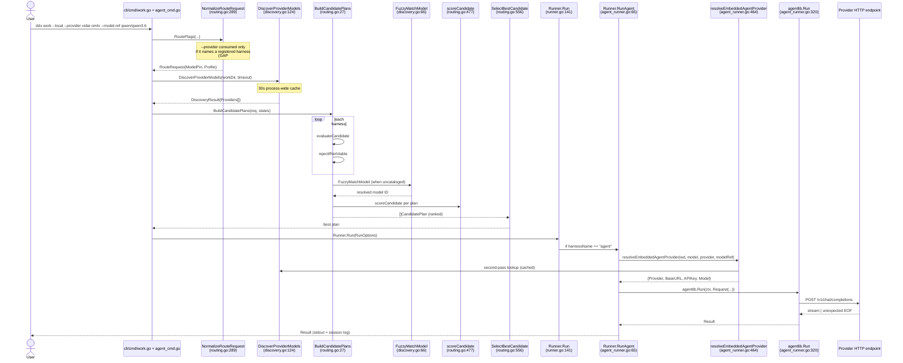

---
ddx:
  id: SD-015-trace
  depends_on:
    - SD-015
    - FEAT-006
---
# Resolution Path Trace: CLI Flag → HTTP Request

**Companion doc to** [SD-015 Agent Routing and Catalog Resolution](SD-015-agent-routing-and-catalog-resolution.md) and [SD-023 Agent Routing Visibility](SD-023-agent-routing-visibility.md).

SD-015 and SD-023 describe *intent* — what the routing layer should do across
five routing modes. This document describes *reality* — how one concrete CLI
invocation flows through every layer of the code today, with file:line
citations. It exists so a newcomer debugging a routing bug can read one
document instead of reverse-engineering the flow from `routing.go`,
`discovery.go`, `agent_runner.go`, `runner.go`, and `agent_cmd.go`.

**Author's invocation used throughout this trace:**

```bash
ddx work --once --local --provider vidar-omlx --model-ref qwen/qwen3.6
```

**Citations are anchored to base revision `654b4cdcd9200fa8db6c38d6af9dad2acfbaa779` (2026-04-18).**
Line numbers drift as the code evolves — see the *CI citation check* section
at the end for how this document is kept in sync.

## Current Gaps (as of 2026-04-18)

Each gap links to its tracking bead. Update this table when a bead closes or a
new structural defect is discovered.

| # | Gap | Visible at | Tracking bead |
|---|-----|------------|---------------|
| 1 | `RouteRequest` has no `Provider` field; `--provider` is silently dropped during normalization unless it names a registered harness. | `cli/internal/agent/types.go:337` (struct def); `cli/internal/agent/routing.go:305` (only consumed as harness alias) | [ddx-8610020e](#) — routing: add Provider field to RouteRequest |
| 2 | `RunOptions.Provider` is a parallel path consumed by `resolveHarness()` and `resolveNativeAgentProvider()` — bypasses the routing layer entirely for the embedded-agent harness. | `cli/internal/agent/runner.go:382`; `cli/internal/agent/agent_runner.go:519` | [ddx-2f5a2284](#) — ModelRef/Profile paths must consult discovery for `--provider` + catalog override |
| 3 | `FuzzyMatchModel` does no case-folding and no canonical-prefix normalization. `qwen/qwen3.6` will not match `Qwen3.6-35B-A3B-4bit` because the slash, vendor prefix, and case are treated literally. | `cli/internal/agent/discovery.go:76` | [ddx-0486e601](#) — fuzzy matcher lacks case + canonical-prefix normalization |
| 4 | `scoreCandidate` has no provider-affinity bonus: when two harnesses can serve the same discovered model, the scorer does not prefer the harness whose provider actually advertised the model. | `cli/internal/agent/routing.go:477` | [ddx-3c5ba7cc](#) — tier escalation must respect `--provider` affinity |
| 5 | Fuzzy-match tiebreak picks shortest-suffix, not highest-version. `qwen3` against `[qwen3.5-27b, qwen3.6-35b]` picks `qwen3.5`. | `cli/internal/agent/discovery.go:100` | [ddx-0216b966](#) — discovery fuzzy match tiebreak |
| 6 | No pre-dispatch capability check — context window, tool support, effort, permissions. | `cli/internal/agent/routing.go:396` (`rejectIfNotViable` covers availability only) | [ddx-4817edfd](#) — pre-dispatch capability check |

## Sequence Diagram



## Layer 1 — CLI flag parse

`ddx work` is a thin alias for `ddx agent execute-loop`. All flags are cloned
from the inner command.

- `cli/cmd/work.go:10` — `newWorkCommand` constructs the alias.
- `cli/cmd/work.go:40` — flags are cloned verbatim from `newAgentExecuteLoopCommand`.
- `cli/cmd/agent_cmd.go:1319` — `--harness` flag declaration.
- `cli/cmd/agent_cmd.go:1320` — `--model` flag declaration.
- `cli/cmd/agent_cmd.go:1321` — `--provider` flag declaration.
- `cli/cmd/agent_cmd.go:1322` — `--model-ref` flag declaration.
- `cli/cmd/agent_cmd.go:1327` — `--local` flag declaration.
- `cli/cmd/agent_cmd.go:1338` — `runAgentExecuteLoop` entry point reads flags.
- `cli/cmd/agent_cmd.go:1342` through `cli/cmd/agent_cmd.go:1357` — flag values
  are plucked into local variables (`harness`, `model`, `provider`, `modelRef`,
  `effort`, `local`).
- `cli/cmd/agent_cmd.go:1374` — `--local` branch takes the inline path; without
  it the loop submits to the running DDx server.
- `cli/cmd/agent_cmd.go:1384` — `ValidateForExecuteLoop(harness, model, provider, modelRef)`
  runs before any bead is claimed.

The flag values eventually reach `ExecuteBead`, which in turn builds
`RunOptions`:

- `cli/internal/agent/types.go:62` — `RunOptions` struct definition.
- `cli/internal/agent/execute_bead.go:498` — `runner.Run(RunOptions{...})`
  constructs the options, including `Provider: opts.Provider` on line 504.

**Observation:** `RouteFlags` (`cli/internal/agent/types.go:51`) has a `Provider` field; so does
`RunOptions` (`cli/internal/agent/types.go:74`). They are the raw CLI inputs. The gap is not here
— it is at the normalization boundary (Layer 2).

## Layer 2 — Normalize flags into `RouteRequest`

The normalization boundary converts raw CLI flags into the minimal routing ask
that the routing engine evaluates.

- `cli/internal/agent/routing.go:289` — `NormalizeRouteRequest(flags RouteFlags, cfg Config, catalog *Catalog) RouteRequest`.
- `cli/internal/agent/routing.go:294` — `RouteRequest{Effort, Permissions}`
  initial struct. Note the absence of `Provider`.
- `cli/internal/agent/routing.go:303` — `flags.Harness != ""` branch assigns
  `HarnessOverride` directly.
- `cli/internal/agent/routing.go:305` — `flags.Provider != ""` branch: the
  provider flag is **only** consulted as a harness-alias lookup. If
  `--provider vidar-omlx` does not match any entry in `builtinHarnesses`, the
  value is silently discarded.
- `cli/internal/agent/routing.go:318` — `flags.Model != ""` branch routes the
  model through `catalog.NormalizeModelRef` to produce either `ModelRef` (known
  in catalog) or `ModelPin` (exact, bypasses catalog policy).
- `cli/internal/agent/types.go:337` — `RouteRequest` struct definition. Fields:
  `Profile`, `ModelRef`, `ModelPin`, `Effort`, `Permissions`, `HarnessOverride`.
  **No `Provider` field — see Gap #1.**

**Concrete outcome for our invocation:**
`--provider vidar-omlx` does not name a registered harness, so the provider
flag is dropped at `cli/internal/agent/routing.go:305`. `--model-ref qwen/qwen3.6` flows through
`NormalizeModelRef`; since it is not in the shared catalog, it becomes a
`ModelPin`. The resulting `RouteRequest` carries only
`{ModelPin: "qwen/qwen3.6"}`.

## Layer 3 — Discovery probe

- `cli/internal/agent/discovery.go:117` — `init()` sets the process-wide cache
  TTL to `30 * time.Second`.
- `cli/internal/agent/discovery.go:124` — `DiscoverProviderModels(workDir, timeout)` entry.
- `cli/internal/agent/discovery.go:125` through `cli/internal/agent/discovery.go:130` — cache hit returns the cached result if still fresh.
- `cli/internal/agent/discovery.go:141` through `cli/internal/agent/discovery.go:155` — probes every configured provider via `providerstatus.Probe`; silently skips unreachable ones (partial failure is tolerated).
- `cli/internal/agent/discovery.go:162` — cache write under mutex.
- `cli/internal/agent/discovery.go:170` — `InvalidateDiscoveryCache` is the only
  way to force a re-probe in tests.

Discovery is invoked on the routing hot-path only when a `ModelPin` is not in
the catalog:

- `cli/internal/agent/routing.go:576` — in `ProbeAndBuildCandidatePlans`, the
  discovery probe fires when `req.ModelPin != "" && req.ModelRef == "" && r.Discovery == nil`.

Discovery is invoked a second time on the dispatch path:

- `cli/internal/agent/agent_runner.go:521` — in `resolveNativeAgentProvider`,
  `r.Discovery.ProvidersForModel(model)` looks up which providers advertised
  the requested model.

## Layer 4 — Candidate planning

- `cli/internal/agent/routing.go:27` — `BuildCandidatePlans(req, stateOverride)` entry.
- `cli/internal/agent/routing.go:33` through `cli/internal/agent/routing.go:46` — iterates every registered harness. `TestOnly` harnesses (script, virtual) are skipped unless `req.HarnessOverride` names them explicitly — this is the guard that prevents `script` from leaking into standard-tier fallback chains (see ddx-869848ec in the comment on line 40).
- `cli/internal/agent/routing.go:47` — calls `evaluateCandidate` per harness.
- `cli/internal/agent/routing.go:106` — `evaluateCandidate(name, harness, req, stateOverride)`.
- `cli/internal/agent/routing.go:396` — `rejectIfNotViable(plan, req)` runs the
  viability gate. Checks:
  - `cli/internal/agent/routing.go:399` — `!s.Installed`.
  - `cli/internal/agent/routing.go:402` — `!s.Reachable`.
  - `cli/internal/agent/routing.go:405` — `!s.Authenticated`.
  - `cli/internal/agent/routing.go:408` — quota exhausted.
  - `cli/internal/agent/routing.go:411` — degraded.
  - `cli/internal/agent/routing.go:414` — policy violation.
  - `cli/internal/agent/routing.go:418` — harness override mismatch.

Note: none of these check *capability* — context window, tool support, effort
level support. That is Gap #6.

## Layer 5 — Fuzzy matching

- `cli/internal/agent/discovery.go:66` — `FuzzyMatchModel(input)` entry.
- `cli/internal/agent/discovery.go:70` — delegates to `fuzzyMatchInPool` using
  `d.AllModels()` (a flat deduplicated pool across all providers — not per-provider).
- `cli/internal/agent/discovery.go:76` — `fuzzyMatchInPool(input, pool)`.
- `cli/internal/agent/discovery.go:78` through `cli/internal/agent/discovery.go:82` — exact-match short-circuit.
- `cli/internal/agent/discovery.go:89` through `cli/internal/agent/discovery.go:96` — prefix match: candidate `m` is considered if `len(m) > len(input) && m[:len(input)] == input`. **The comparison is case-sensitive and treats slashes literally (Gap #3).**
- `cli/internal/agent/discovery.go:100` through `cli/internal/agent/discovery.go:106` — tiebreak: shortest suffix wins; alphabetical on equal suffix length. **Not version-aware (Gap #5).**

**Concrete outcome for our invocation:**
Pool likely contains `Qwen3.6-35B-A3B-4bit`. Input `qwen/qwen3.6` fails the
exact check, then fails the prefix check because `Q != q` and the slash is not
in the pool entries. The function returns `("", false)`. `resolveNativeAgentProvider`
falls through to the `isOpenRouterModel` heuristic at
`cli/internal/agent/agent_runner.go:544` (vendor/model format → openrouter),
which is not what the operator wanted.

## Layer 6 — Scoring

- `cli/internal/agent/routing.go:477` — `scoreCandidate(profile, plan)` entry.
  Returns a `float64`; higher is better.
- `cli/internal/agent/routing.go:478` — base score `100`.
- `cli/internal/agent/routing.go:485` — `switch profile` over `cheap`, `standard`, `smart`, default.
  - `cheap` (lines 486–493): `local` +40, within-quota subscription +20, penalize `cr * 30`.
  - `standard` (lines 495–502): `local` +25, within-quota +15, penalize `cr * 10`.
  - `smart` (lines 504–512): `cr * 20` bonus (expensive > cheap), within-quota +5.
  - default (lines 514–522): treated as standard.
- `cli/internal/agent/routing.go:525` — quota >80%: penalty scales with over-usage.
- `cli/internal/agent/routing.go:528` — quota state unknown: −3.
- `cli/internal/agent/routing.go:531` — routing-signal freshness: `cached` −1, `stale` −4.
- `cli/internal/agent/routing.go:542` — historical success rate (≥3 samples):
  ≥0.8 +20, <0.5 −30.

**No provider-affinity bonus (Gap #4).** If two harnesses both report viable
for the same requested model, `scoreCandidate` does not look at
`plan.Provider` vs the provider the model was discovered on.

## Layer 7 — Candidate ranking and selection

- `cli/internal/agent/routing.go:434` — `RankCandidates(profile, plans)`.
  - Assigns scores (line 444) or `-1` for non-viable (line 441).
  - Stable sort (lines 448–466): viable before non-viable; descending score;
    tiebreak prefers local-cost candidates, then alphabetical harness name.
- `cli/internal/agent/routing.go:556` — `SelectBestCandidate(plans)` returns
  the first viable plan, or `"no viable harness candidate: all harnesses rejected"`.
- `cli/internal/agent/routing.go:567` — `ProbeAndBuildCandidatePlans` is the
  full-probe wrapper used by actual dispatch (it calls live `ProbeHarnessState`
  per harness before building plans).

## Layer 8 — Dispatch

`Runner.Run` is the dispatch fork:

- `cli/internal/agent/runner.go:141` — `Run(opts RunOptions) (*Result, error)` entry.
- `cli/internal/agent/runner.go:148` — `resolveHarness(opts)` picks the harness.
- `cli/internal/agent/runner.go:376` — `resolveHarness(opts)` definition.
- `cli/internal/agent/runner.go:382` — **Gap #2 origin**: if `opts.Harness == ""` and
  `opts.Provider != ""`, the `--provider` value is looked up as a harness
  alias. If it matches a registered harness (e.g. `agent`, `local`), that
  harness is chosen; otherwise `resolveHarness` falls back to `Config.Harness`.
  This is a parallel path that bypasses `NormalizeRouteRequest` entirely.

Dispatch branches (in order):

- `cli/internal/agent/runner.go:165` — `harnessName == "virtual"` → `RunVirtual(opts)`.
- `cli/internal/agent/runner.go:170` — `harnessName == "agent"` → `RunAgent(opts)` (embedded).
- `cli/internal/agent/runner.go:175` — `harnessName == "script"` → `RunScript(opts)`.
- `cli/internal/agent/runner.go:187` — HTTP-provider harnesses with no binary (`lmstudio`, `openrouter`): surfaces the harness name as `opts.Provider` and delegates to `RunAgent`. The comment on lines 185–186 references `ddx-501e87ef` — the bug where cheap-tier attempts were burning <1s with "exec: no command".
- `cli/internal/agent/runner.go:278` — default exec path: `Executor.ExecuteInDir(ctx, harness.Binary, args, stdin, execDir)`.

Embedded agent dispatch:

- `cli/internal/agent/agent_runner.go:65` — `RunAgent(opts)`.
- `cli/internal/agent/agent_runner.go:94` — `resolveEmbeddedAgentProvider(wd, model, opts.Provider, opts.ModelRef)`.
- `cli/internal/agent/agent_runner.go:464` — `resolveEmbeddedAgentProvider` entry.
- `cli/internal/agent/agent_runner.go:493` — `resolveNativeAgentProvider(workDir, model, explicitProvider, explicitModelRef)`.
- `cli/internal/agent/agent_runner.go:519` — **Gap #2 again**: `explicitProvider != ""` overrides the default provider with the raw `opts.Provider` string. This is where `--provider vidar-omlx` finally re-enters the flow, but by now the routing engine has already ranked candidates without knowing about it.
- `cli/internal/agent/agent_runner.go:521` through `cli/internal/agent/agent_runner.go:548` — discovery-based provider resolution: if the model isn't in the catalog and discovery has results, route to the first provider that advertises the model (exact or fuzzy).
- `cli/internal/agent/agent_runner.go:555` — `cfg.BuildProviderWithOverrides(providerName, overrides)` materializes the provider object from the native agent config.

## Layer 9 — Wire-level HTTP request

The embedded agent library builds the request body and dispatches to the
provider endpoint. DDx hands off at `agentlib.Run`.

- `cli/internal/agent/agent_runner.go:127` — system prompt construction via
  `prompt.NewFromPreset(agentCfg.Preset).WithTools(tools).WithContextFiles(...).WithWorkDir(wd).Build()`.
- `cli/internal/agent/agent_runner.go:153` — `agentlib.Request` assembly:
  `Prompt`, `SystemPrompt`, `Provider`, `Tools`, `MaxIterations`, `WorkDir`,
  `Metadata`, `Compactor`.
- `cli/internal/agent/agent_runner.go:320` — `agentResult, err := agentlib.Run(ctx, req)`
  — handoff into the `github.com/DocumentDrivenDX/agent` library. DDx does not
  own the HTTP transport from here on.
- `cli/internal/agent/agent_runner.go:688` — `buildAgentProvider(cfg)` creates
  the provider used by the request. Branches:
  - `openai-compat` or `openai` (line 691): `oai.New(oai.Config{BaseURL, APIKey, Model})`.
  - `anthropic` (line 697): `anthropic.New(anthropic.Config{APIKey, Model})`.
  - `virtual` (line 702): `virtual.New(virtual.Config{DictDir})`.

For `vidar-omlx`, the native-config resolution at `resolveNativeAgentProvider`
loads the provider block from `~/.config/agent/config.yaml` or
`.agent/config.yaml`. The HTTP layer is OpenAI-compatible; the request body is
the standard `/v1/chat/completions` payload built inside the agent library,
with tool schemas appended.

The agent library exposes its wire-level dump via the `AGENT_DEBUG_WIRE`
environment variable (introduced in ddx-agent v0.3.12 — see ddx-a0f7a4bb).

## Layer 10 — Response parsing

- `cli/internal/agent/agent_runner.go:320` — same line; `agentlib.Run` returns
  `(AgentResult, error)` and DDx inspects the result starting at line 323.
- `cli/internal/agent/agent_runner.go:336` through `cli/internal/agent/agent_runner.go:349` — maps
  `agentResult.Tokens`, `agentResult.ToolCalls`, `agentResult.SelectedProvider`,
  etc. into DDx `Result`.
- `cli/internal/agent/agent_runner.go:355` — wall-clock deadline → error.
- `cli/internal/agent/agent_runner.go:358` — idle timeout → error.
- `cli/internal/agent/agent_runner.go:361` — compaction-stuck circuit breaker →
  error.
- `cli/internal/agent/agent_runner.go:364` — stall detector (30 consecutive
  read-only tool calls) → error.
- `cli/internal/agent/agent_runner.go:367` — generic agent error, including the
  `ErrProviderRequestTimeout` wrapper (line 369).
- `cli/internal/agent/agent_runner.go:380` — agent non-success status (e.g.
  `StatusCancelled`).

The `unexpected end of JSON input` error reported in ddx-6a5dfe35 surfaces
from inside the agent library's streaming decoder; DDx sees it via the generic
error branch at line 367 and forwards the message unchanged. The agent library
owns the decode (DDx does not duplicate JSON parsing at this layer).

## Cross-References

- [SD-015 Agent Routing and Catalog Resolution](SD-015-agent-routing-and-catalog-resolution.md) — intent/specification.
- [SD-023 Agent Routing Visibility](SD-023-agent-routing-visibility.md) — routing evidence and
  `ddx agent doctor` projections.
- [FEAT-006 Agent Service](../../01-frame/features/FEAT-006-agent-service.md) — the enclosing feature.

## Maintenance — CI citation check

This document's value depends on its citations matching reality. A lefthook
pre-commit hook parses every `file:line` citation in this file and verifies
that the named file exists and the line exists; a stricter mode verifies a
symbol hint (function, struct, method) appears at or near the cited line.

- Hook: `lefthook.yml` → `pre-commit.resolution-path-citations`.
- Script: `scripts/verify-resolution-path-citations.sh`.

To add a new citation: cite as `path/to/file.go:NNN` in the body of this
document. The script parses the backtick-quoted `path:line` patterns and runs
`awk 'NR==NNN'` on the file. If the line does not exist, the hook fails.

When legitimate code churn invalidates citations, update this document in the
same PR that moved the code — do not let the hook slip on `--no-verify`.
