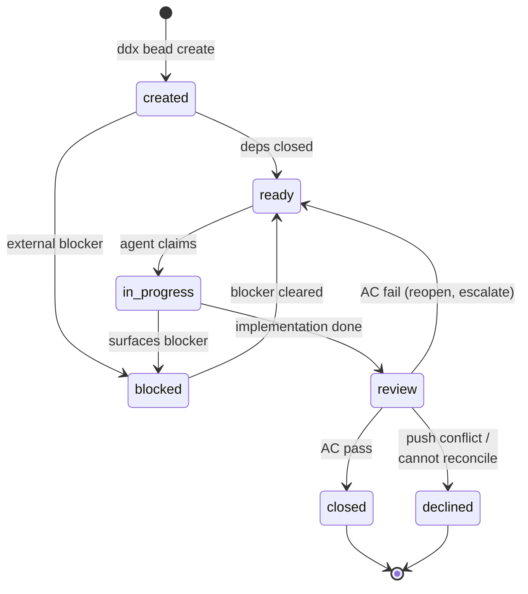
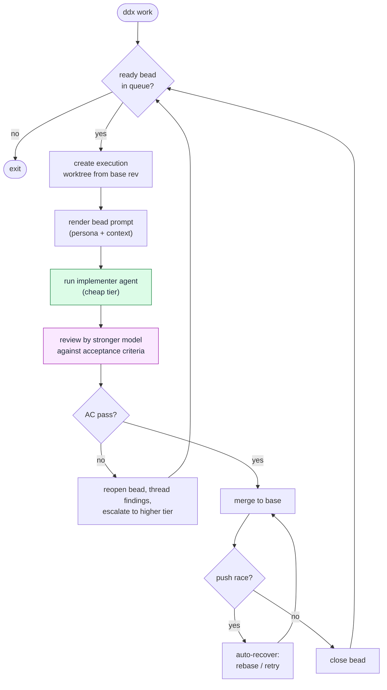
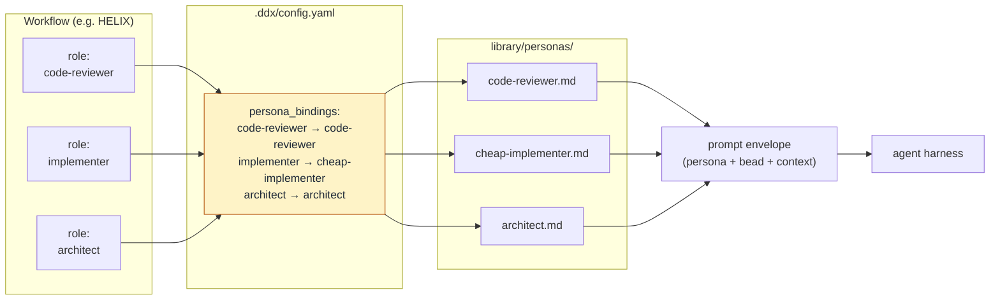
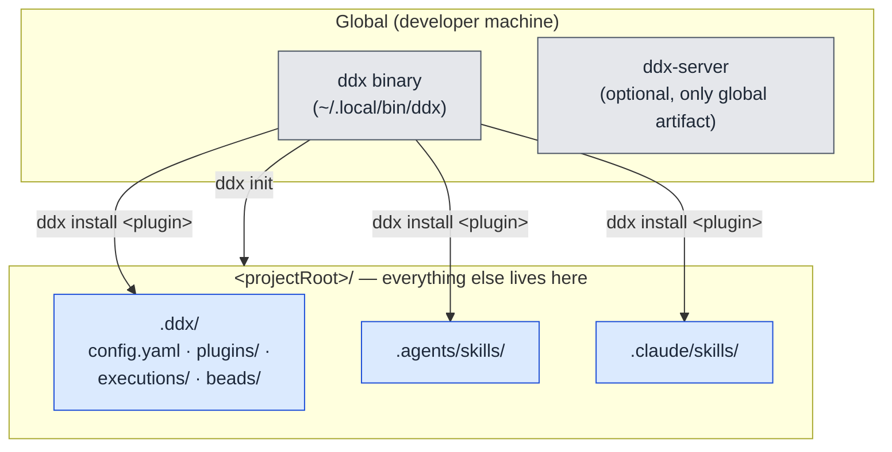

This page covers the concrete moving parts: how beads flow through the queue,
how `ddx work` drains it by composing `ddx try` on top of `ddx run`, how
personas attach to roles, and what the project-local install model means on
disk. For the layered run model in detail, see
[Run Architecture](../run-architecture/).

For exhaustive specifications, follow the `FEAT-*` references into
`docs/helix/01-frame/features/` in the repository.

## Bead Lifecycle

A bead is a self-contained unit of work with an ID, title, description,
acceptance criteria, labels, and a dependency edge set. Beads live in the
project's bead store and move through a small set of states.

```
created → ready → in-progress → review → closed
              ↘ blocked ↗
```

- **created** — a bead exists but isn't pickable yet (often because deps
  aren't closed).
- **ready** — all dependencies are closed; the bead is in the work queue.
- **in-progress** — an agent or developer has claimed it.
- **review** — implementation done; an automated or human review is checking
  the acceptance criteria.
- **closed** — review passed; the bead is done.
- **blocked** — surfaced separately when something external prevents
  progress.

`ddx bead ready` lists pickable work. `ddx bead status` shows the queue
shape. `ddx bead dep tree` visualizes the DAG. See **FEAT-004** for the bead
tracker spec.




**Why beads, not tickets?** Beads are local files in JSONL, not records in
an external tracker. They diff, they merge, they branch with the code.
Importing from `bd`/`br` keeps you portable.


## The Run Architecture

DDx drains the bead queue through three layered run primitives. Each
higher layer composes the layer beneath it.

```
┌────────────────────────────────────────────────────┐
│  ddx work — drain the bead queue                   │
└────────────────────────────────────────────────────┘
        │  iterates
        ▼
   ddx try <bead>  ── no ready beads ──▶ exit
        │
        ▼
   create execution worktree from base rev
        │
        ▼
   ddx run  (cheap tier)  with bead prompt
        │
        ▼
   review by stronger model against acceptance criteria
        │
   ┌────┴────┐
   pass      fail
   │          │
   ▼          ▼
  merge     reopen bead, escalate to higher tier
   │          │
   └────┬─────┘
        ▼
   next bead
```

The three layers — `ddx run`, `ddx try`, `ddx work` — are **cost-tiered by
design**: the implementer is a cheap model, the reviewer is a stronger one,
and deterministic checks sit above review catching what slipped
through. Failed reviews thread the findings into the next attempt's prompt
so the escalating model knows exactly what was missed.

`ddx work` is the user-facing queue-drain entry point. Under the hood it
iterates `ddx try <bead>`, which in turn wraps one or more `ddx run`
invocations. See [Run Architecture](../run-architecture/) for the layered
contract and **FEAT-006** (agent service) plus **FEAT-010** (run
architecture) for the underlying specifications.



## Personas and Role Binding

A **persona** is a document that shapes how an agent behaves. DDx ships
personas like `code-reviewer`, `implementer`, `test-engineer`, and
`architect`. Each is a Markdown file with behavioral instructions.

A **role** is an abstract function — "the thing that reviews code", "the
thing that implements features". Projects bind specific personas to roles
in `.ddx.yml`:

```yaml
persona_bindings:
  code-reviewer: code-reviewer
  architect: architect
  implementer: cheap-implementer
```

When an agent is dispatched for a role, the bound persona is composed into
the prompt envelope along with bead context, project config, and any
relevant patterns. Swapping a persona is a one-line config change, not a
code change.

This separation is why the layered run architecture's cost tiering works
cleanly — the implementer role binds to a cheap-tier persona, the reviewer
role binds to a strong-tier one, and `ddx work` never hardcodes a model
name.



## Project-Local Install Model

DDx installs are **project-local**. The only global artifact is the `ddx`
binary itself (and optionally `ddx-server`). Everything else lives under the
project root.

After `ddx init`:

```
<projectRoot>/
├── .ddx/
│   ├── config.yaml          # project DDx config
│   ├── plugins/             # installed plugins (local only)
│   │   └── ddx/             # the default DDx plugin (library)
│   ├── executions/          # ddx try / ddx work evidence
│   └── beads/               # bead store (JSONL)
├── .agents/
│   └── skills/              # agent-facing skills
└── .claude/
    └── skills/              # Claude-specific skill installs
```

`ddx install <plugin>` only writes under those three trees. There is no
`~/.ddx`. There is no `ddx install --global`. Cloning the repo gives a
collaborator the entire DDx surface for the project; deleting `.ddx/`
removes it.

This is a deliberate inversion of the usual CLI pattern. It makes:

- **Reproducibility** — the repo is the source of truth.
- **Onboarding** — `git clone && ddx doctor` is enough.
- **Cleanup** — reversible by file deletion.

See **FEAT-015** for the installation architecture spec.



## How the Pieces Fit

The bead tracker decides **what** to do. The persona system decides **how**
the agent should approach it. The three-layer run architecture
(`ddx run` / `ddx try` / `ddx work`) runs the agent and routes results. The
project-local install model means all of that is in the repo, not in a
developer's home directory or a remote service.

That's the whole platform. Phases, gates, and methodology live one layer up
in HELIX; deterministic verification lives in the check runner.
